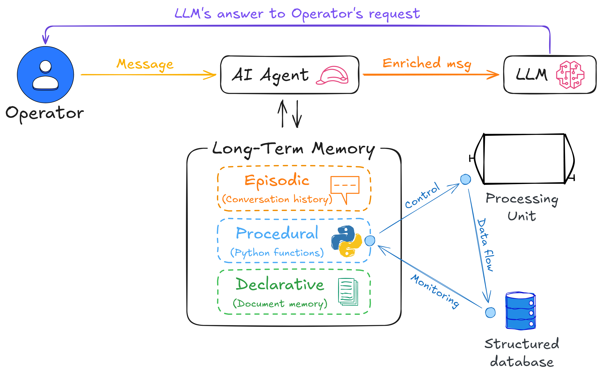

# Cheshire Cat AI Toolkit for Industry 4.0/5.0 applications


# Introduction
The Cheshire Cat AI Toolkit for Industry 4.0/5.0 it is a young (no-budget) project that aims to be dedicated to harnessing the power of conversational AI in industrial applications, enabling the integration of advanced Large Language Models (LLMs) in critical areas such as process monitoring, control and optimisation. Seamlessly integrated with the [Cheshire Cat AI](https://cheshire-cat-ai.github.io/docs/), an open source and AI-agnostic conversational framework for building AI agents, these tools provide a foundation for developing intelligent and adaptive industrial systems.
The initial (ambitious) idea is to integrate it into a smart food drying system to monitor and (hopefully) control the process by interacting with an LLM via dedicated CLIs and plugins.
Below is a schematic of the idea:



At the moment, the toolkit includes a Python-based CLI to chat with LLMs and a tool to access a structured SQL database connected to the process.
More to come...

## Requirements
- `Python 3.10 or higher`
- `cheshire_cat_api` [library](https://github.com/cheshire-cat-ai/api-client-py/tree/main)
- `requests` library (for HTTP operations)

## Installation
1. Install Cheshire Cat AI on your server and configure it
2. Clone this repository:
    ```bash
    git clone https://github.com/rmoscetti/chashire-cat-ai-tools.git
    cd cheshire-cat-ai-tools
    ```
3. Install the required dependencies:
    ```bash
    pip install -r requirements.txt
    ```

# Cheshire Cat CLI
`cat_chat.py` is a python-based CLI for chatting with the Cheshire Cat AI. The script establishes a WebSocket connection to send messages and retrieve responses in real time. Its primary purpose is to communicate with the Cheshire Cat AI while prioritising the use of procedural memory by (optionally) eliminating history communications, which may currently be responsible for the AI agent not suggesting the use of procedural memory to the LLM. It also supports saving AI responses to a JSON file.

## Features
- **Send Messages**: Communicate with the Cheshire Cat AI server via WebSocket.
- **History Management**: Option to maintain or clear conversation history before sending messages.
- **Save Responses**: Store server responses in a JSON file.
- **Configurable**: Set user ID, authentication key, server URL, and other parameters via command-line arguments.

## Usage
1. Ensure the Cheshire Cat AI server is running and accessible at the specified `--base_url` and `--port`.

2. Run the script with the following command:
```bash
python cat_chat.py "your message here" --user_id YOUR_USER_ID --auth_key YOUR_AUTH_KEY [OPTIONS]
```

## Command-Line Arguments
| Argument      | Description                                                     | Default    | Required |
|---------------|-----------------------------------------------------------------|------------|----------|
| `message`     | The message to send to the server.                | N/A        | Yes      |
| `--user_id`   | The user ID for authentication.                                | N/A        | Yes      |
| `--auth_key`  | The authentication key (password) for the server.            | N/A        | Yes      |
| `--base_url`  | The base URL (IP address) of the server.                       | `127.0.0.1`| No       |
| `--port`      | The port number of the server.                           | `1865`     | No       |
| `--history`   | Set to `false` to clear the conversation history before sending the message. | `false` | No       |
| `--filename`  | The filename to save the JSON response from the server.        | N/A        | No       |

## Examples
To send a message and save the response:
```bash
python cat_chat.py "Is the process running?" --user_id USER123 --auth_key ABC123 --filename response.json
```
To send a message without clearing the chat history:
```bash
python cat_chat.py "Is the process running?" --user_id USER123 --auth_key ABC123 --history true
```
To clear history before sending a message:
```bash
python cat_chat.py "Is the process running?" --user_id USER123 --auth_key ABC123 --history false
```

# Contributing
Contributions are welcome! Feel free to fork this repository, make your changes, and submit a pull request.

# License
This project is licensed under the MIT License. See the [LICENSE](https://choosealicense.com/licenses/mit/) for details.

# Author
Roberto Moscetti rmoscetti@unitus.it
(pls contact me if you want to contribute to the project)
